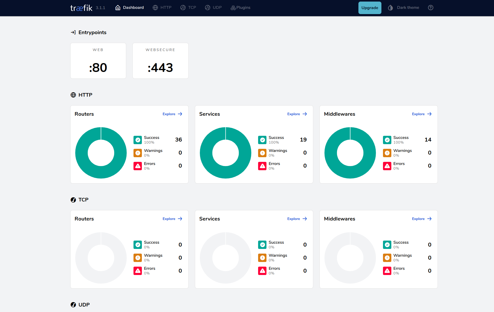

# Homelab Docker Server

## Overview

This project configures a Homelab Docker server with a simple setup that includes services like:

- [**Socket-proxy**](https://docs.linuxserver.io/images/docker-socket-proxy/): A secure proxy for Docker's socket, designed to expose only the necessary functionality to specific applications. It helps to reduce the risk of exposing the Docker socket directly.
  
- [**Traefik**](https://doc.traefik.io/traefik/): A modern reverse proxy and load balancer that makes deploying microservices and applications in Docker easier with built-in support for Let's Encrypt, dynamic service discovery, and many other features.
    

- [**CrowdSec**](https://www.crowdsec.net): An open-source security engine that detects and blocks attacks based on crowdsourced data. It helps protect the server from various threats, leveraging a community-driven approach.
  

- [**Authentik SSO**](https://goauthentik.io): An authentication and Single Sign-On (SSO) solution that simplifies the management of user accounts and permissions across multiple services in your infrastructure.
  

- [**Portainer**](https://www.portainer.io): A powerful, easy-to-use management UI for Docker, providing insight and control over Docker containers, images, networks, and volumes.
  

- [**Servarr**](https://wiki.servarr.com): A suite of applications designed for media management automation, including apps like Sonarr, Radarr, Lidarr, and more, to manage your TV shows, movies, music, and other media collections.

- [**Homepage**](https://gethomepage.dev/latest/): A modern, fully static, fast, secure fully proxied, highly customizable application dashboard with integrations for over 100 services and translations into multiple languages. Easily configured via YAML files or through docker label discovery.
  

The project is currently evolving, and contributions (PRs) are welcome!

Secrets and user permissions will also be progressively implemented to improve security and ease of use.

## Documentation

The project documentation (work in progress) is available in both French and English:

- [French Documentation](./docs/doc_fr.md)
- [English Documentation](./docs/doc_en.md)