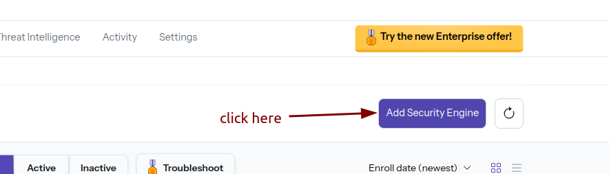
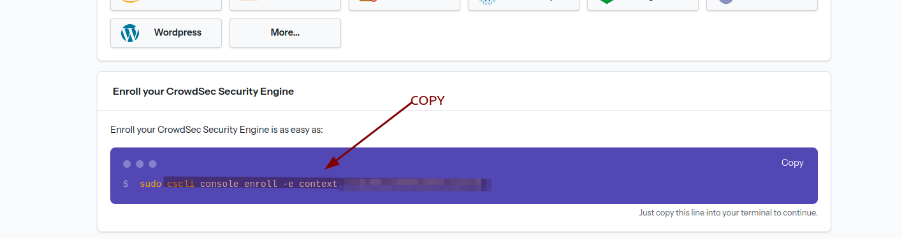
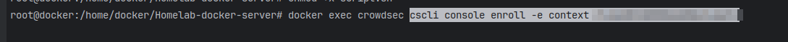
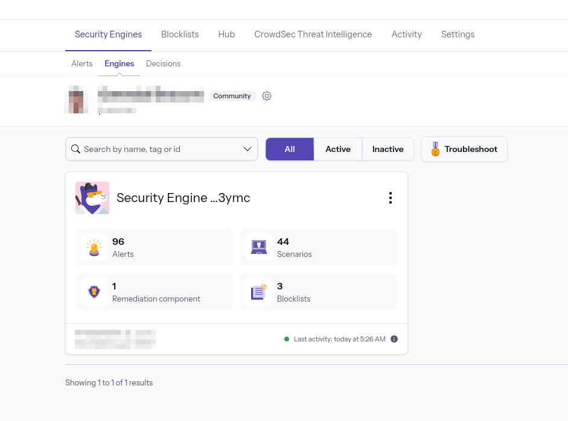
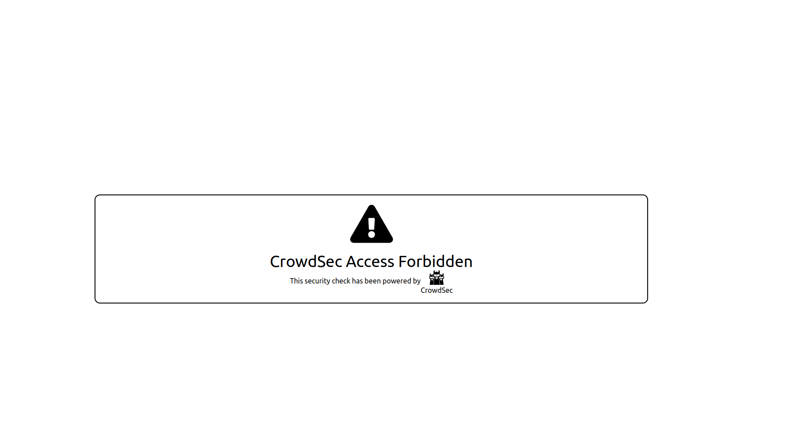

# Homelab Docker Server

## Version Information

The secrets will be set up progressively, taking into account the compatibility of each service.

This project configures a Homelab Docker server with a simple setup. In the future, more services will be added.

## Project Inspiration and More Details

### CrowdSec

- [CrowdSec Blog - Enhance Docker Compose Security](https://www.crowdsec.net/blog/enhance-docker-compose-security)
- [Traefik Bouncer GitHub](https://github.com/maxlerebourg/crowdsec-bouncer-traefik-plugin)
- [Traefik Bouncer Tutorial](https://plugins.traefik.io/plugins/6335346ca4caa9ddeffda116/crowdsec-bouncer-traefik-plugin)

### Project Architecture Inspiration and Authentik Documentation:

- [GitHub - brokenscripts](https://github.com/brokenscripts/authentik_traefik)
- Thanks to @brokenscripts

## Initial Setup

1. **Rename the `.env.example` file to `.env`.**

2. **Fill in the variables in the `.env` file:**
   - `DOMAINNAME`: Domain name.
   - `TZ`: Time zone.
   - Create an account on [CrowdSec](https://www.crowdsec.net) (free).
   - Create a secret with the API key generated on Cloudflare for Let's Encrypt. See the [tutorial here](https://youtu.be/n1vOfdz5Nm8?si=a7WRX2rLfm4HydtU&t=1012).
   - Add the Cloudflare API key to `/secret/cf_dns_api_token`.

3. Generate the secrets for Authentik:

# Secrets to Create

The following secrets (defined in the base `compose.yaml` file) need to be created:

I recommend creating secrets with the following syntax:
```bash
echo -n 'VALUE_CHANGEME' > SECRET_NAME_CHANGEME
```

Check out Traefik's info at https://doc.traefik.io/traefik/https/acme/#providers. Cloudflare specific information: https://go-acme.github.io/lego/dns/cloudflare/
- `cf_email`
- `cf_dns_api_token`
  ```bash
  echo -n 'CHANGEME@gmail.com' > cf_email
  echo -n 'CHANGEME-LONGAPI-CHANGEME' > cf_dns_api_token
  ```

Specific to Authentik (https://docs.goauthentik.io/docs/installation/docker-compose#preparation)
- `authentik_postgresql_db`
- `authentik_postgresql_user`
- `authentik_postgresql_password`
- `authentik_secret_key`
  ```bash
  echo -n 'authentik_db' > authentik_postgresql_db
  echo -n 'authentik_user' > authentik_postgresql_user
  openssl rand 36 | base64 -w 0 > authentik_postgresql_password
  openssl rand 60 | base64 -w 0 > authentik_secret_key
  ```

Create a Gmail account and enter the information:
- `gmail_smtp_username`
- `gmail_smtp_password`
  ```bash
  echo -n 'CHANGEME@gmail.com' > gmail_smtp_username
  echo -n 'CHANGEME' > gmail_smtp_password
  ```

Go to https://dev.maxmind.com/geoip/geolite2-free-geolocation-data to generate a free license key (https://www.maxmind.com/en/accounts/current/license-key) for use.
- `geoip_account_id`
- `geoip_license_key`
  ```bash
  echo -n 'CHANGEME' > geoip_account_id
  echo -n 'CHANGEME' > geoip_license_key
  ```

---

4. **Let's Encrypt Configuration in `/appdata/traefik/config/traefik.yaml`:**

   **Development Mode**
   - During installation, ensure the line `caServer: https://acme-v02.api.letsencrypt.org/directory` is commented out.
   - Replace `CHANGEME` with your email.

   **Switch to Production:**
     - Delete the `acme.json` file in `/appdata/traefik/data/`.
     - Uncomment the line `caServer: https://acme-v02.api.letsencrypt.org/directory` in `/appdata/traefik/config/traefik.yaml`.
     - Restart the project to obtain a production SSL certificate.

## Project Launch

1. **Start the project:**

   Navigate to the `/my-compose/` folder where the `docker-compose.yaml` file is located, then run the command:

   ```bash
   docker compose up -d
   ```

2. **Check the services:**

   To check if all services are active, run:

   ```bash
   docker ps
   ```

   *Tip: To read the logs of a specific container, use:*

   ```bash
   docker logs 'container_name'
   ```

3. **Add the security engine on CrowdSec:**

   - Go to [CrowdSec](https://www.crowdsec.net), click on "Add Security Engine," and copy the token displayed after `sudo`.

   
   

4. **Run the following command in the terminal:**

   ```bash
   docker exec crowdsec cscli console enroll -e context 'retrieved token'
   ```

   

5. **Return to the CrowdSec website:**

   - In the "Engines" section, accept the invitation. You should see an active item appear.

   

6. **Create the Traefik bouncer:**

   To allow CrowdSec to read Traefik logs, run:

   ```bash
   docker exec crowdsec cscli bouncers add traefik-bouncer
   ```

7. **Add the API key:**

   - Copy the generated API key and set the variable `CROWDSEC_TRAEFIK_BOUNCER_LAPI_KEY` in the `.env` file located in `/my-compose/.env`.

8. **Restart the project:**

   ```bash
   docker compose up -d --force-recreate
   ```

9. **Wait a few minutes for the CrowdSec service to activate:**
   - After a few minutes, you should see the active page on the CrowdSec web interface.

   

## Additional Information

- **Logs**: To read the startup logs of CrowdSec or Traefik, use the following commands:

   ```bash
   docker logs --tail 100 -f traefik
   ```

   ```bash
   docker logs --tail 100 -f crowdsec
   ```

- **If errors occur:** Delete the `config` folder and restart the services with:

   ```bash
   docker compose up -d --force-recreate
   ```

   If that fails, delete the `appdata/crowdsec/db` and `appdata/crowdsec/config` folders and restart the setup from scratch (bouncer + add engine).

- **Add a database other than SQLite:**
   - First, launch the project with SQLite.
   - Follow the tutorial [CrowdSec database custom](https://docs.crowdsec.net/docs/next/local_api/database/).
   - Edit the file `appdata/crowdsec/config/crowdsec/config.yaml`.
   - Delete the `appdata/crowdsec/data` folder.
   - Reconfigure from scratch (engine + bouncer).

- **Available `cscli` commands:** Check the documentation [here](https://docs.crowdsec.net/docs/cscli/).

### Qbittorrent (documentation coming soon)

To retrieve the Qbittorrent password: run the command

`docker logs qbittorrent`.

### Servarr (documentation coming soon):

### Authentik

Follow this documentation [Authentik](https://github.com/brokenscripts/authentik_traefik/blob/traefik3/README.md)