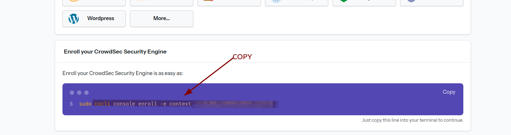
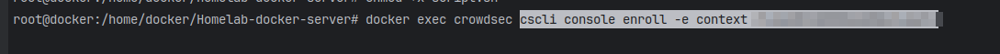
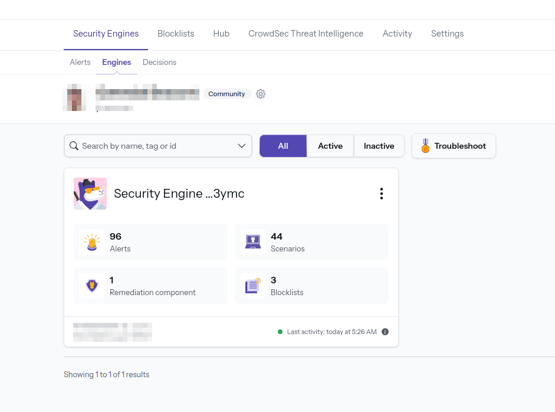

# Homelab Docker Server

## Information de version

Les secrets seront mis en place progressivement, en prenant en compte les compatibilités de chaque service.

Ce projet configure un serveur Homelab Docker avec une configuration simple à l'avenir, d'autres services 

## Inspiration du projet et plus de détails

### CrowdSec

- [CrowdSec Blog - Enhance Docker Compose Security](https://www.crowdsec.net/blog/enhance-docker-compose-security)
- [Traefik Bouncer GitHub](https://github.com/maxlerebourg/crowdsec-bouncer-traefik-plugin)
- [Traefik Bouncer Tutorial](https://plugins.traefik.io/plugins/6335346ca4caa9ddeffda116/crowdsec-bouncer-traefik-plugin)

### Inspiration architecture du projet et documentation pour authentik : 

- [GitHub - brokenscripts](https://github.com/brokenscripts/authentik_traefik)
- Merci à @brokenscripts

## Configuration Initiale

1. **Renommer le fichier `.env.example` en `.env`.**

2. **Renseigner les variables dans le fichier `.env` :**
   - `DOMAINNAME` : Nom de domaine.
   - `TZ` : Fuseau horaire.
   - Créer un compte sur [CrowdSec](https://www.crowdsec.net) (gratuit).
   - Créer un secret avec la clé API générée sur Cloudflare pour Let's Encrypt. Voir le [tutoriel ici](https://youtu.be/n1vOfdz5Nm8?si=a7WRX2rLfm4HydtU&t=1012).
   - Ajouter la clé API Cloudflare dans `/secret/cf_dns_api_token`.

3. Génerer les secrets pour authentik : 

# Secrets à créer

Les secrets suivants (définis dans le fichier `compose.yaml` de base) doivent être créés :

Je vous recommande de créer les secrets avec la syntaxe suivante :
```bash
echo -n 'VALEUR_CHANGEME' > NOM_DU_SECRET_CHANGEME
```

Consultez les informations sur Traefik à l'adresse suivante : https://doc.traefik.io/traefik/https/acme/#providers. Informations spécifiques à Cloudflare : https://go-acme.github.io/lego/dns/cloudflare/
- `cf_email`
- `cf_dns_api_token`
  ```bash
  echo -n 'CHANGEME@gmail.com' > cf_email
  echo -n 'CHANGEME-LONGAPI-CHANGEME' > cf_dns_api_token
  ```

Spécifique à Authentik (https://docs.goauthentik.io/docs/installation/docker-compose#preparation)  
- `authentik_postgresql_db`
- `authentik_postgresql_user`
- `authentik_postgresql_password`
- `authentik_secret_key`
  ```bash
  echo -n 'authentik_db' > authentik_postgresql_db
  echo -n 'authentik_user' > authentik_postgresql_user
  openssl rand 36 | base64 -w 0 > authentik_postgresql_password
  openssl rand 60 | base64 -w 0 > authentik_secret_key
  ```

Créez un compte Gmail et saisissez les informations :  
- `gmail_smtp_username`
- `gmail_smtp_password`
  ```bash
  echo -n 'CHANGEME@gmail.com' > gmail_smtp_username
  echo -n 'CHANGEME' > gmail_smtp_password
  ```

Allez sur https://dev.maxmind.com/geoip/geolite2-free-geolocation-data pour générer une clé de licence gratuite (https://www.maxmind.com/en/accounts/current/license-key) à utiliser.
- `geoip_account_id`
- `geoip_license_key`
  ```bash
  echo -n 'CHANGEME' > geoip_account_id
  echo -n 'CHANGEME' > geoip_license_key
  ```

---

4. **Configuration Let's Encrypt dans `/appdata/traefik/config/traefik.yaml` :**

   **Developpement mode**
   - Pendant l'installation, assurez-vous que la ligne `caServer: https://acme-v02.api.letsencrypt.org/directory` est commentée.
   - remplacez `CHANGEME` par votre email

   **Passage en production :**
     - Supprimez le fichier `acme.json` dans `/appdata/traefik/data/`.
     - Décommentez la ligne `caServer: https://acme-v02.api.letsencrypt.org/directory` dans `/appdata/traefik/config/traefik.yaml`.
     - Relancez le projet pour obtenir un certificat SSL en production.


## Lancement du Projet

1. **Démarrer le projet :**

   Allez dans le dossier `/my-compose/` où se trouve le fichier `docker-compose.yaml`, puis exécutez la commande :

   ```bash
   docker compose up -d
   ```

2. **Vérification des services :**

   Pour vérifier que tous les services sont actifs, exécutez :

   ```bash
   docker ps
   ```

   *Astuce : Pour lire les logs d'un conteneur spécifique, utilisez :*

   ```bash
   docker logs 'nom_du_conteneur'
   ```

3. **Ajouter le moteur de sécurité sur CrowdSec :**

   - Allez sur [CrowdSec](https://www.crowdsec.net), cliquez sur "Add Security Engine", et copiez le token affiché après `sudo`.

   
   

4. **Exécuter la commande suivante dans le terminal :**

   ```bash
   docker exec crowdsec cscli console enroll -e context 'token récupéré'
   ```

   

5. **Retourner sur le site CrowdSec :**

   - Dans la section "Engines", acceptez l'invitation. Vous devriez voir un élément actif apparaître.

   

6. **Créer le bouncer Traefik :**

   Pour que CrowdSec puisse lire les logs de Traefik, exécutez :

   ```bash
   docker exec crowdsec cscli bouncers add traefik-bouncer
   ```

7. **Ajouter la clé API :**

   - Copiez la clé API générée et définissez la variable `CROWDSEC_TRAEFIK_BOUNCER_LAPI_KEY` dans le fichier `.env` situé dans `/my-compose/.env`.

8. **Relancer le projet :**

   ```bash
   docker compose up -d --force-recreate
   ```

9. **Attendre quelques minutes pour l'activation du service CrowdSec :**
   - Après quelques minutes, vous devriez voir la page active sur l'interface web de CrowdSec.

   

## Informations supplémentaires

- **Logs** : Pour lire les logs de démarrage de CrowdSec ou Traefik, utilisez les commandes suivantes :

   ```bash
   docker logs --tail 100 -f traefik
   ```

   ```bash
   docker logs --tail 100 -f crowdsec
   ```

- **En cas d'erreurs :** Supprimez le dossier `config` et relancez les services avec :

   ```bash
   docker compose up -d --force-recreate
   ```

   Si cela échoue, supprimez les dossiers `appdata/crowdsec/db` et `appdata/crowdsec/config` puis recommencez la configuration depuis le début (bouncer + add engine).

- **Ajouter une base de données autre que SQLite :**
   - Lancez d'abord le projet avec SQLite.
   - Suivez le tutoriel [CrowdSec database custom](https://docs.crowdsec.net/docs/next/local_api/database/).
   - Modifiez le fichier `appdata/crowdsec/config/crowdsec/config.yaml`.
   - Supprimez le dossier `appdata/crowdsec/data`.
   - Reconfigurez à partir de zéro (engine + bouncer).

- **Commandes `cscli` disponibles :** Consultez la documentation [ici](https://docs.crowdsec.net/docs/cscli/).


### Qbittorrent (documentation à venir)

Pour obtenir le mot de passe Qbittorrent : exécutez la commande 

`docker logs qbittorrent`.

### Servarr (documentation à venir) :


### AUthentik

suivre cette documentation [Authentik](https://github.com/brokenscripts/authentik_traefik/blob/traefik3/README.md)